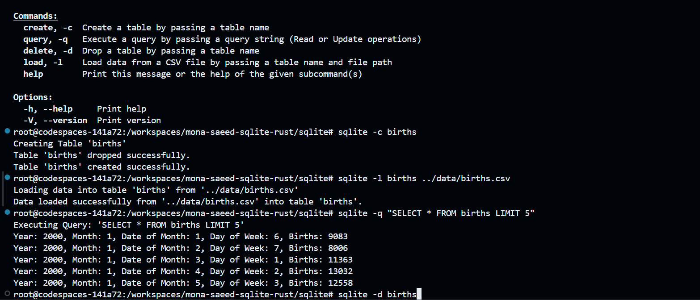

# Python vs. Rust
[](https://github.com/nogibjj/mts79-mini-project-8/actions/workflows/ci_python.yml)

[](https://github.com/nogibjj/mts79-mini-project-8/actions/workflows/CI.yml)

## Overview

The sqlite is a command line utility designed to perform CRUD (Create, Read, Update, Delete) operations on the `births.csv` file included in the data folder. This tool allows users to manage the dataset effectively through various command line commands.

## Features

- **Create**: Create a new table in the `births_database.db` SQLite database based on the `births.csv` schema.
- **query**: Execute custom SQL queries to retrieve data from the database.
- **Delete**: Drop tables or delete records from the database.
- **Load Data**: Load data from the `births.csv` file into the SQLite database.

## Prerequisites

- Rust installed on your machine. You can follow the instructions [here](https://www.rust-lang.org/tools/install).

## Installation

1. Clone the repository:

   ```bash
   git clone https://github.com/nogibjj/mona-saeed-sqlite-rust
   cd mona-saeed-sqlite-rust
   cd sqlite
   ```
run `sqlite -h` to see available options
.png>)

## Example Usage

